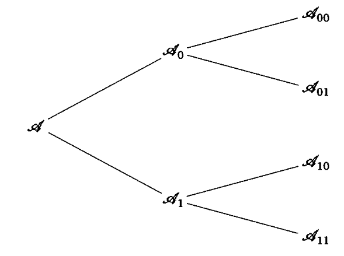

#### Вопрос 11

##### Алфавитное кодирование Фано

На вход алгоритма поступает алфавит $A = \{a_1,\dots ,a_m\}, (m\geq 2)$ и распределение вероятностей $\vec{p} = (p_1,\dots, p_m)$, причем $p_1\geq p_2 \geq\dots\geq p_m$ 

Выберем число $k, 1\leq k <m$, так чтобы величина $|\sum\limits_{i=1}^kp_i-\sum\limits_{i=k+1}^mp_i|$ была минимальной. Разобьём множество $A = \{a_1,\dots ,a_m\}$ на подмножества: $A = A_0\sqcup A_1$, где $A_0 = \{a_1,\dots ,a_k\}, A_1 = \{a_{k+1},\dots ,a_m\}$.

Следующие шаги алгоритма определим индуктивно. Предположим, что уже задано подмножество $A_{i_1,\dots ,i_t} \subseteq A$, где $i_1, \dots, i_t \in \{0, 1\}$. 

Если подмножество $A_{i_1,\dots ,i_t}$ состоит из единственного символа $a_j$, то для этого символа определяем кодирование $\varphi(a_j) = i_1,\dots, i_t$. Если же в подмножестве $A_{i_1,\dots ,i_t} = \{a_j,\dots, a_s\}$ не менее двух символов, то выберем число $k, j\leq k<s$, так, чтобы минимизировать величину $|\sum\limits_{i=j}^kp_i-\sum\limits_{i=k+1}^sp_i|$ и разобьем множество $A_{i_1,\dots ,i_t, 0} = \{a_j,\dots, a_k\}$ и $A_{i_1,\dots ,i_t, 1} = \{a_{k+1},\dots, a_s\}$

Процесс разбиения на подмножество продолжается, пока не получим все одноэлементные подмножества и тем самым не определим кодирование $\varphi$ всюду на алфавите $A$.

