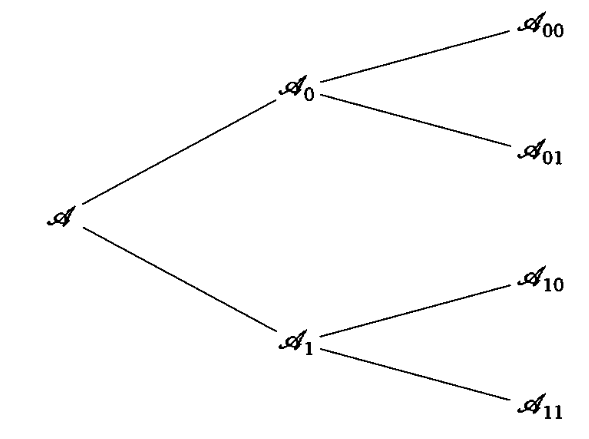

#### Вопрос 01

##### Однозначно декодируемый код

*(Чечета)*

Алфавитное кодирование $\varphi: A \rightarrow B$ называется однозначно декодируемым, если отображение $\varphi *$ инъективно (разные в разные).

#### Вопрос 02

##### Префиксный код

Алфавитное кодирование $\varphi: A \rightarrow B$ называется префексным, если накакое кодовое слово $\varphi(a_i)$ не является началом какого-либо другого кодового слова $\varphi (a_j), (i \neq j)$

#### Вопрос 03

##### Средняя длина кодового слова

Пусть задан алфавит источника *A* и кодовый алфавит *B* и распределение *p*. Тогда средней длиной кодового слова кодирования $\varphi:A \rightarrow B$ называется величина: 
$$
l_{ср}=\sum_{i=1}^n p(a_i)l_i
$$

#### Вопрос 04

##### Степень сжатия

**Коэффициент(степень) сжатия** - отношение длин двух закодированных сообщений двумя кодерами при кодировании одинаковых исходных сообщений

*или*

отношение средних длин двух кодов. *(надо исправить)*

*(Из лекции)*

Пусть заданы 2 кодирующих отображения $\varphi^*_1:A^*\rightarrow B^*$ и $\varphi^*_2:A^*\rightarrow B^*$. *Относительной степенью сжатия* для последовательности $a_{i_1}...a_{i_n}$ назовем отношение длин кодовых векторов 
$$
\frac{l(\varphi^*_1(a_{i_1}...a_{i_n}))}{l(\varphi^*_2(a_{i_1}...a_{i_n}))}=\rho_{\frac{\varphi^*_1}{\varphi^*_2}}(a_{i_1}...a_{i_n})
$$

#### Вопрос 05

##### Неравенство Крафта

1. Если $\varphi:A \rightarrow B^*$ - D-ичное префиксное алфавитное кодирование с длинами код. слов  $len(\varphi(a_i))=l_i$, $1 \leq i \leq m$, (*m* - мощность алфавита *A*) то справедливо: 

$$
\sum_{i=1}^m D^{-l_i}\leq 1 (*)
$$

2. Если натуральные числа D, m, $l_1$... $l_m$ удовлетворяют неравенству (*), то $\exist$ D-ичное префиксное алфавитное кодирование с длинами код. слов: 
   $$
   l_i=len(\varphi(a_i)); 1\leq i \leq m
   $$

#### Вопрос 06

##### D-ичная последовательность Хаффмана

(прим. Это только мое предположение, но похоже, что спрашивается алгоритм Хаффмана для $D\geq 2$)

*1-й этап - слияние*. Подсчитываем параметр $m$ - количество кодовых слов в исходном алфавите. Найдем параметр $k$, такой что $m_0 = 1 + k(D-1)$ причем должно выполнятся условие $m_0\geq m$ с наименьшим превосходством. Затем находим параметр $S = m - m_0 + D$ - количество слияний на первом шаге, после этого все слияния будут размера $D$.

Слияние происходит путем сложения $D$ наименьших вероятностей.

*2-й этап - кодирование.* Предположим, что уже заданы кодирования $\varphi_{k-1}, \varphi_{k-2},\dots,\varphi_{i+1}$, и зададим кодирование $\varphi_i:A^{(i)}\rightarrow B^\ast$ следующим образом. Если алфавит $A^{(i+1)}$  был получен из алфавита $A^{(i)}$ слиянием некоторых $s$ символов $a_1',\dots,a_s'$ в один новый символ $\sigma'$, то кодирование $\varphi_i$ получается из кодирования $\varphi_{i+1}$ заменой одного равенства $\varphi_{i+1}(\sigma') = w\in B^\ast$ на $s$ равенств $\varphi_i(a_j') = wb_j, 1\leq j\leq s.$

Второй этап алгоритма завершается построением искомого кодирования $\varphi=\varphi_0$.

#### Вопрос 07

##### Теорема кодирования Шеннона для ИБП

*(из Википедии)*

Теорема Шеннона для ИБП связывают энтропию источника и возможность сжатия кодированием с потерями и последующим неоднозначным декодированием. 

Прямая теорем показывает, что с помощью кодирования с потерями возможно достичь степени сжатия
$$
\frac{N}{L}\approx\frac{H(U)(1+\varepsilon)}{log_2D}
$$
сколь угодно близкой к энтропии источника, но все же больше последней. Обратная показывает, что лучший результат не достижим.

U - некоторый источник сообщений

H(U) - энтропия источника

N - длина сообщения после кодирования

L - длина сообщения до кодирования *(?)*

D - мощность алфавита кодера

*(умная формулировка)*

Для источника без памяти *U* с энтропией *H(U)* и любого $\varepsilon>0$ существует последовательность множеств однозначно декодирования $M_L$ мощности $2^{L(1+\varepsilon)H(U)}$ такая, что вероятность множества неоднозначного декодирования стремится к нулю $P(M^C_L)\rightarrow0$ при увеличении длины блока $L\rightarrow\infin$. Другими словами, сжатие возможно.

#### Вопрос 08

##### Оптимальное кодирование

*(Чечета)*

Алфавитное кодирование называется оптимальным, если

1. оно однозначно декодируемого
2. его средняя длина минимальна

#### Вопрос 11

##### Алфавитное кодирование Фано

На вход алгоритма поступает алфавит $A = \{a_1,\dots ,a_m\}, (m\geq 2)$ и распределение вероятностей $\vec{p} = (p_1,\dots, p_m)$, причем $p_1\geq p_2 \geq\dots\geq p_m$ 

Выберем число $k, 1\leq k <m$, так чтобы величина $|\sum\limits_{i=1}^kp_i-\sum\limits_{i=k+1}^mp_i|$ была минимальной. Разобьём множество $A = \{a_1,\dots ,a_m\}$ на подмножества: $A = A_0\sqcup A_1$, где $A_0 = \{a_1,\dots ,a_k\}, A_1 = \{a_{k+1},\dots ,a_m\}$.

Процесс разбиения на подмножество продолжается, пока не получим все одноэлементные подмножества и тем самым не определим кодирование $\varphi$ всюду на алфавите $A$.

#### Вопрос 12

##### Алфавитное кодирование преф/суфф

Алфавитное кодирование $\varphi$(и набор кодовых слов $\varphi(A)$) называем префиксным(суффиксным), если никакое кодовое слово $\varphi(a_i)$ не является началом(окончанием) какого-либо другого кодового слова $\varphi(a_j), i\neq j$

#### Вопрос 13

##### Утверждение $\varphi$ является преф/суфф

Если алфавитное кодирование $\varphi$ является префиксным или суффиксным, то оно - однозначно декодируемо. Обратное неверно.

#### Вопрос 14

##### Неравенство Мак-Миллана

*Теорема 3.3*

Если алфавитная кодирование $\varphi:A\rightarrow B^*$ с длинами кодовых слов $len(\varphi(a_i)) = l_i, 1\leq i\leq m,$ является однозначно декодируемым, то справедливо неравенство  $\sum\limits_{i=1}^mD^{-l_i}\leq 1$

#### Вопрос 15

##### Оценка $l^\varphi$ ($l_{ср}$)

*(Чечета)*

Средняя длина оптимального алфавитного кодирования $\varphi$ удовлетворяет неравенствам. 
$$
\frac{H(\vec p)}{log_2D} \leq l_{ср} \leq 1 + \frac{H(\vec p)}{log_2D} 
$$

